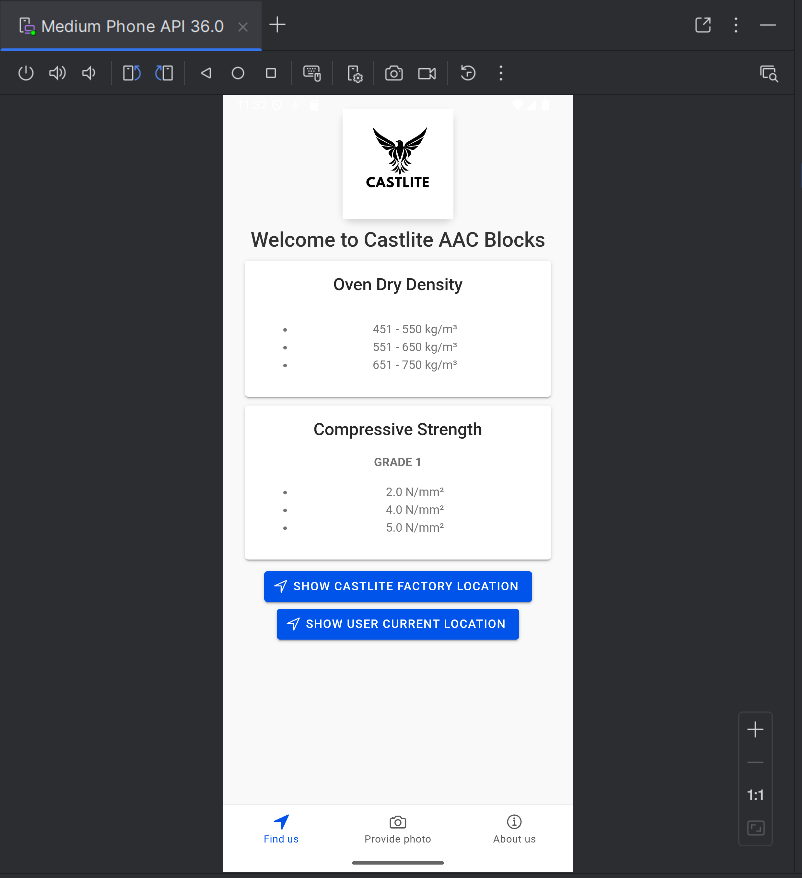
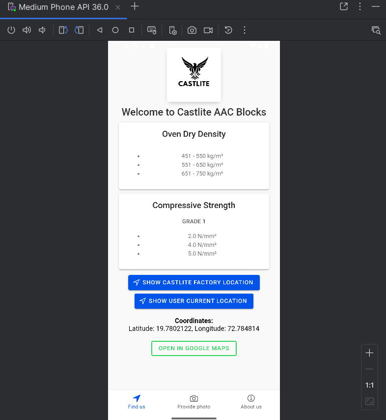
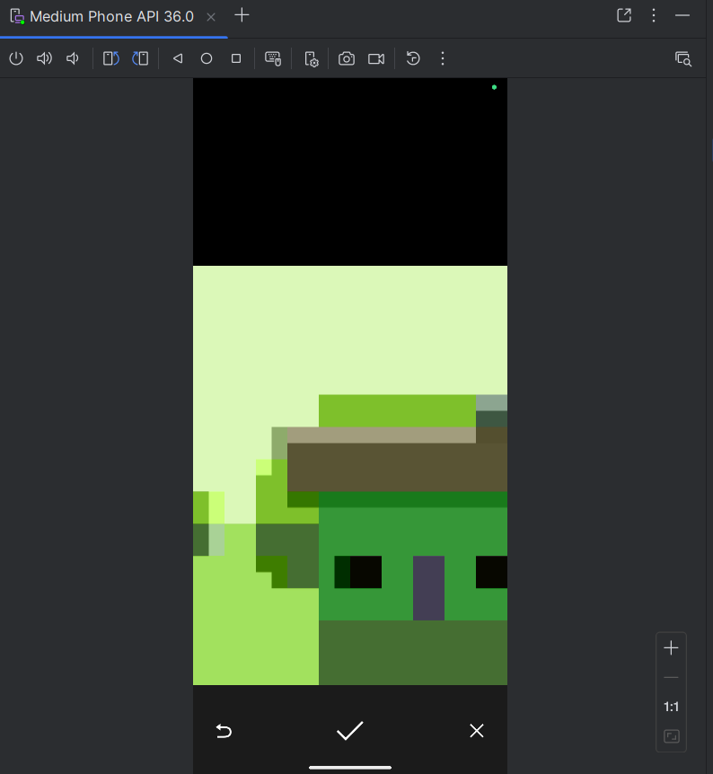
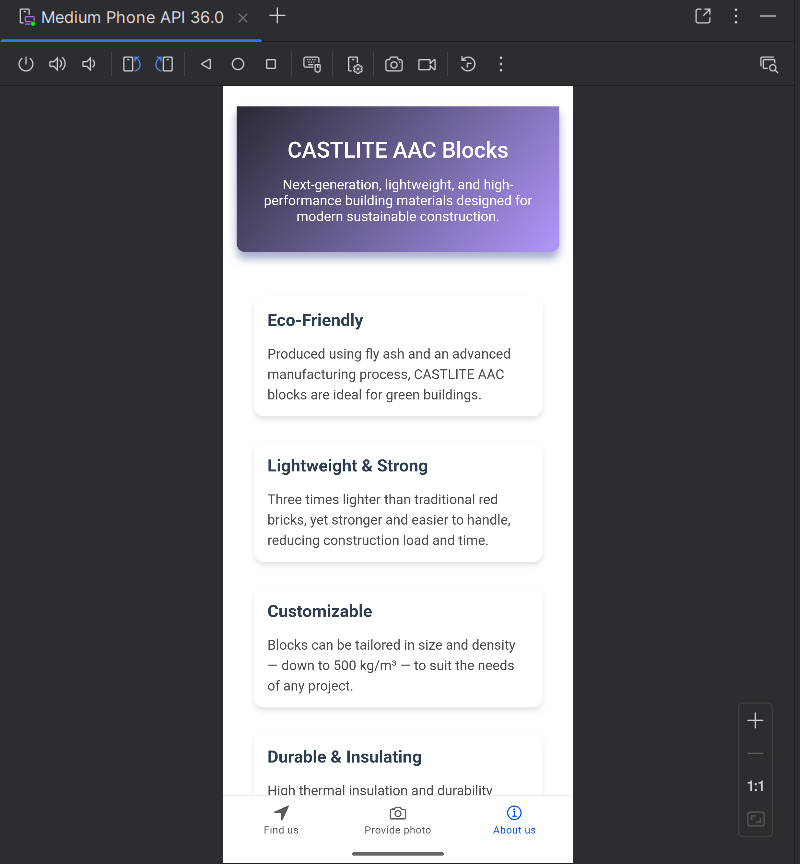

# Module Title:  Web and Mobile Technologies 
# Module Code:  B9IS124
# Module Leader:  Ehtisham Yasin 
# Assessment Title: Develop a hybrid mobile application 
# App : CATLITE for AAC Blocks
 
# About 
It is the hybrid mobile app aimed at facilitating the work of a company that produces and delivers AAC (Autoclaved Aerated Concrete) blocks. There is an in-built Google Maps feature that allows users to see the google map location of the company. The program enables sharing the site localization of the construction projects that one is working on and uploading real time photos. Also, the app offers news on the exclusive features of CASTLITE AAC Blocks in terms of their environmentally-friendly, versatility, and other features of the brands. It also the option of contacting the company.

# Scenarios :
Tab 1: Find us
Locating the Company location using Google Maps and User Location
- A new client wants to visit the exact location of the CASTLITE AAC Blocks company’s.
- Client Can share there company live location 
Tab 2: Provide Photo
Uploading Real-Time Photos from client Site
- A construction supervisor wants to send real-time updates on the usage of AAC blocks at the construction site.
- The user clicks on “Capture Photo”
Tab 3: About CASTLITE AAC Block Features
- An architect is exploring eco-friendly construction options and wants to learn about CASTLITE AAC Blocks.
- Provided contact details
- scroll down on about us page.

For icon and splash : added png in /resources/splash.png and /resources/icon.png with 512x512 and 2732x2732 size respectively.
It has a personalized splash screen and adaptive icons on Android.

## Technology: 
Angular and ionic framework
Capacitor
## Plugins :
Camera Plugin 
Geolocation Plugin

## Github link: 
https://github.com/Srush-02/webmobileCA2

## Commands: 
npm install -g @ionic/cli
ionic
ionic start
used ngModular application for single module

ionic start Castlite tabs --type=angular

Plugin: 
npm install @capacitor/camera
npm install @capacitor/geolocation

npx cap sync android 
ionic build
npx cap copy android
npx cap open android

to add splash and icon
npx @capacitor/assets generate --icon resources/icon.png --splash resources/splash.png

Remove-Item -Recurse -Force resources\android\icon\*
Remove-Item -Recurse -Force android\app\src\main\res\mipmap-*

add img into ionic folder
cordova-res android --copy --force

## Scrren Shorts:

tab2:

tab3:

## Refrences: 
From class notes
https://capacitorjs.com/docs
https://ionicframework.com/docs

